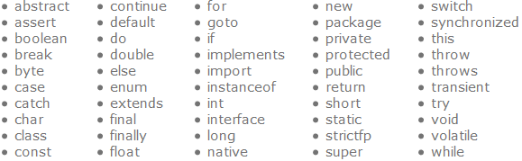
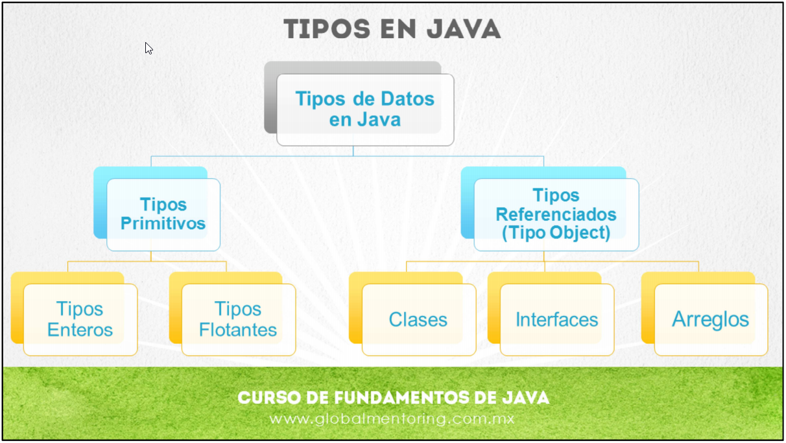
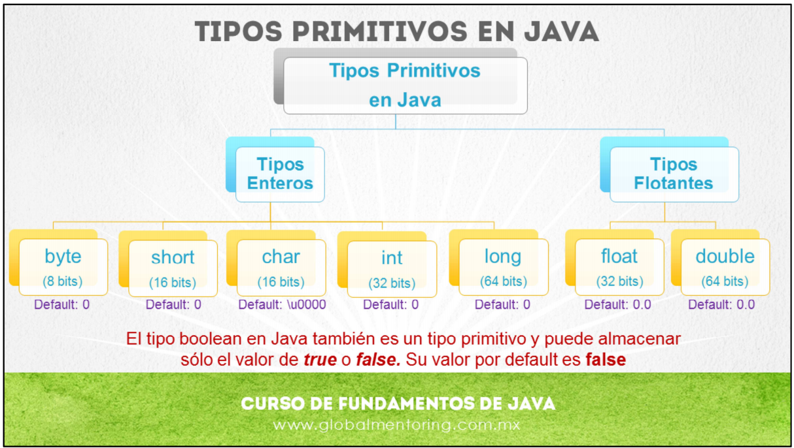

# CURSO COMPLETO DE JAVA

## INSTALACIONES

Para empezar a trabajar con Java, es requerido descargar e instalar el JDK de Oracle.

> https://www.oracle.com/java/technologies/javase-jdk11-downloads.html

Posteriormente, es necesario instalar un Entorno de Desarollo Integrado, se recomienda usar Apache NetBeans.

> https://netbeans.apache.org/download/nb120/nb120.html

## FUNDAMENTOS DE JAVA

### VARIABLES

Una variable nos va a permitir almacenar información, esta información, esta información va a ser los datos que vamos a procesar en nuestro programa, por tanto, estos datos van a variar, según la información que estemos recibiendo por parte del usuario o la información que estemos procesando.

Una variable va a tener un identificador y va a almacenar un valor, pero este valor puede cambiar al paso del tiempo.

Las variables pueden almacenar valores con distintos tipos de datos.

En Java, existen diferentes tipos de datos, los cuales, se clasifican en dos categorias:

- Tipos Primitivos
  - Tipos Enteros
  - Tipos Flotantes

* Tipos Referenciados (Tipo Object)
  - Clases
  - Interfaces
  - Arreglos

#### USO DE VAR

A partir de la versión 10 de Java, podemos usar la palabra reservada `var` para declarar una variable, y `var`, definirá el tipo de dato de la variable de acuerdo a su literal o valor.

Para poder hacer uso de la palabra reservada `var` en la definición de variables, es obligatorio asginar una literal.

#### REGLAS DE IDENTIFICADOR

Existen reglas para definir el identificador de una variable.

* El primer caracter del identificador puede ser cualquier letra del alfabeto inglés.
* El primer caracter no debe ser un numero o caracteres especiales.
* Por convención se recomienda que la primera letra sea minúlcula, y si el nombre se conforma por dos o mas palabras conviene que esten juntos pero la inicial de cada palabra inicie en mayúscula excepto la primera.
* Los caracteres permitidos como inicio para definición de identificadores son el guión bajo `_` y el signo del dolar `$`.
* No se deben usar palabras reservadas para definir variables:
  

### CONCATENACIÓN DE CADENAS

Para unir dos o más variables de tipo `String`, usamos el operador `+`. El operador `+` es el único operador que tiene dos funciones: concatenar cadenas y sumar números.

Existe una regla en el uso del operador `+` cuando se concatenan y suman valores en una misma línea. Esta regla consiste en evaluar las expresiones de izquierda a derecha, en donde si la primera es de tipo numérico ***sumará*** su valor a la siguiente expresión, pero si es una cadena, realiza la ***concatenación*** a la siguiente expresión.

### CARACTERES ESPECIALES

* \n: salto de línea
* \t: tabulador
* \b: retroceso
* \': comilla simple
* \": comilla doble

### EXÁMEN

1. ¿Cuál es la salida del siguiente código?: `B`
  
  ~~~
  var nombre = “Juan”;
  System.out.println(nombre);
  nombre = “Carlos”;
  System.out.println(nombre);
  ~~~

  a)  Juan
      Juan

  b)  Juan
      Carlos

  c)  Carlos
      Carlos

  d)  error

2. ¿Cuál es la salida del siguiente código?: `C`
  
  ~~~
  String color;
  System.out.println(color);
  color = “Rojo”
  ~~~

  a)  Rojo

  b)  El programa se ejecuta correctamente, pero nada se imprime en la consola

  c)  Error

3. ¿Qué variable se nombra correctamente?: `B`
  
  a)  `String TituloCancion`

  b)  `String tituloCancion`

  c)  `String titulocancion`

4. ¿Qué variable se nombra correctamente?: `D`

a) `int personaid;`

b) int personaID

c) `int personaId`;

5. ¿Cuál es la salida del siguiente código?: `C`
  
  ~~~
  a = “A”;
  System.out.println(a);
  a = “B”;
  System.out.println(b);
  ~~~

  a)  A
      B

  b)  A
      A

  c)  Error

### PRÁCTICA

Se solicita incluir la siguiente información acerca de un libro:

* titulo
* autor

Debes imprimir la información en el siguiente formato:

  ~~~
  Proporciona el titulo:
  Proporciona el autor:
  <titulo> fue escrito por <autor>
  ~~~

Puedes utilizar el IDE de tu preferencia para desarrollar la solución y después pegar aquí tu respuesta, ya que este editor no contiene ningún tipo de ayuda.

Preguntas de esta tarea
1. ¿Cuál es el código del requerimiento solicitado?

### TIPOS DE DATOS

En Java existen distintos tipos de datos, por un lado los tipos primitivos y por otro lado tenemos los tipos que se consideran como extensiones de la clase Object, también conocidos como referencia a objetos.

Respecto a los tipos primitivos podemos clasificarlos en tipos Enteros y Flotantes, sin embargo tenemos también el tipo boolean.

Por el contrario, tenemos los tipos Object, los cuales pueden ser Clases,
Interfaces o Arreglos (Arrays) en Java.

Por un lado tenemos los tipos enteros, entre los cuales tenemos el tipo byte el cual ocupa 8 bits. Posteriormente tenemos el tipo short, el cual ocupa 16 bits. También tenemos el tipo char, el cual ocupa 16 bits pero maneja el código UNICODE para almacenar valores tipo char. A su vez tenemos el tipo int el cual ocupa 32 bits, y finalmente el tipo long el cual ocupa 64 bits.

Por otro lado tenemos los tipos flotantes, por un lado el tipo float el cual ocupa 32 bits, y el tipo double que ocupa 64 bits. El tipo boolean en Java también es un tipo primitivo y puede almacenar sólo el valor de true o false. Su valor por default es false.

Estos tipos de Java son los mas básicos y son los que utilizaremos si necesitamos la mayor rapidez y ahorro en recursos, con el objetivo de que nuestros algoritmos sean lo más eficientes. 

